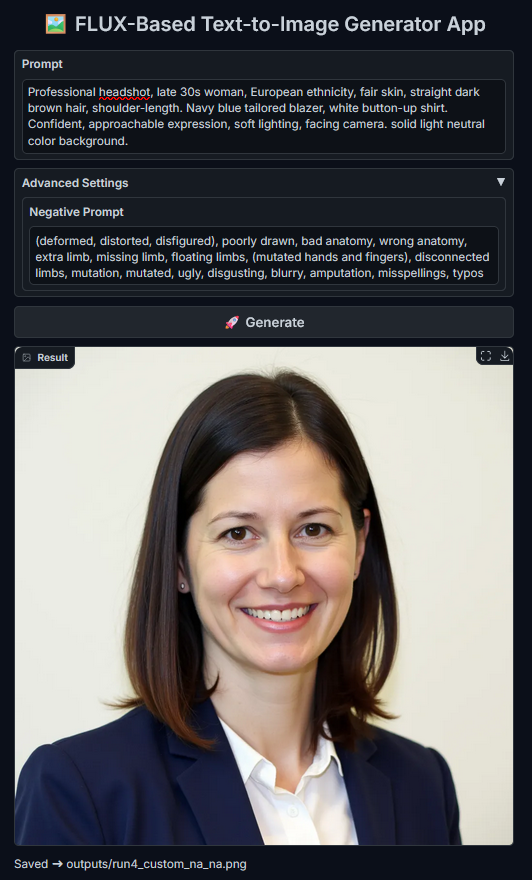
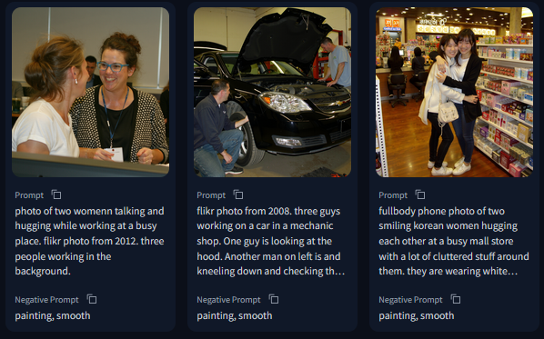

# 🖼️ FLUX-Based Text-to-Image Generator App

This is a **Gradio-powered image generation app** built using the `FluxPipeline` from Hugging Face's `diffusers` library. It leverages LoRA fine-tuned weights to produce high-quality 1024x1024 profile portraits from text prompts.

---

## 🔍 UI Preview

<p align="center">
  
</p>

---

## 🎨 Sample Output Examples

<p align="center">
  
</p>


---

## 📁 Directory Structure

```
.
├── main.py                    # Gradio app and core runner
├── requirements.txt           # Python dependencies
├── prompts.json               # Example prompts to test
└── utils/
    ├── pipeline.py            # FluxPipeline loading, LoRA setup, and config
    └── helper_functions.py    # Helpers like run ID tracker, file management, etc.
```

---

## 🚀 Features

- ✅ **LoRA Integration**: Loads `boreal-flux-dev-v2` weights for stylistic fine-tuning.
- ✅ **Negative Prompt Control**: Fine-tune undesired visual traits.
- ✅ **Responsive UI**: Built using `Gradio` with a clean, centered layout.
- ✅ **Image Saving**: Each image is saved with a structured filename inside `outputs/`.
- ✅ **Prompt Examples**: Try out sample prompts from `prompts.json`.

---

## ⚙️ Setup Instructions

### 1. Clone the Repository

```bash
git clone https://github.com/shemayon/flux-profile-generator.git
cd flux-profile-generator
```

### 2. Create a Virtual Environment (Optional but Recommended)

```bash
python -m venv venv
source venv/bin/activate  # On Windows: venv\Scripts\activate
```

### 3. Install Dependencies

```bash
pip install -r requirements.txt
```

Ensure that your machine has a CUDA-compatible GPU and `torch` is correctly installed for GPU use.

---

## ▶️ Run the App

```bash
python main.py
```

Then open your browser at `http://127.0.0.1:7860`.

---


## 📸 Output Naming Convention

Generated images are saved as:

```
outputs/run<run_id>_<image_id>_<gender>_<age>.png
```

Example:

```
outputs/run7_002_female_25.png
```

---

## 🧠 Credits

- [`black-forest-labs/FLUX.1-dev`](https://huggingface.co/black-forest-labs/FLUX.1-dev)
- [`kudzueye/boreal-flux-dev-v2`](https://huggingface.co/kudzueye/boreal-flux-dev-v2)
- Built with ❤️ using [Gradio](https://www.gradio.app/)

---

## 📬 Feedback

Pull requests, issues, and suggestions are welcome!
